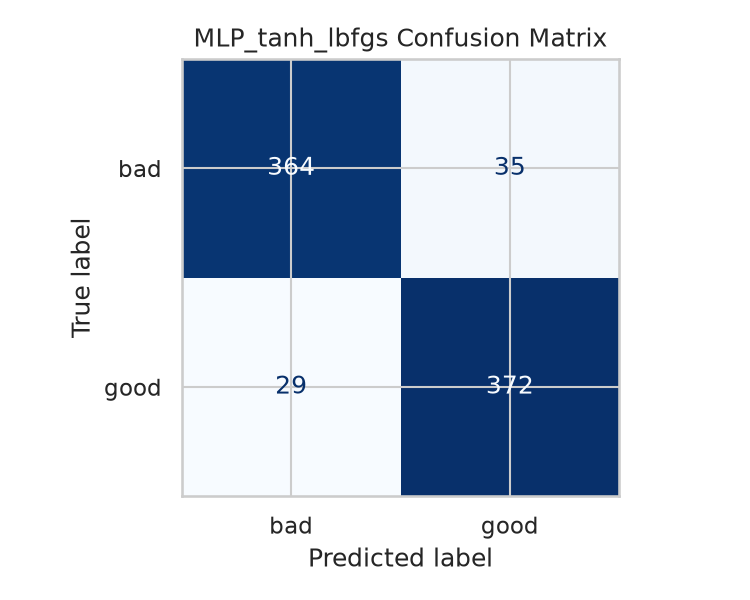

# Technical Report: Apple Quality Classification with Multilayer Perceptrons

## a) Problem statement
The goal of this project is to classify apple quality (`good` vs. `bad`) using a multilayer perceptron (MLP) model and the `apple_quality.csv` dataset located in the Downloads folder. The workflow required package loading, preprocessing, feature subsetting, train/test splitting, model training, prediction, quantitative evaluation, visual evaluation, confusion matrices, and calculation of precision, recall, and f-measure for each classifier.

This implementation uses two MLP classifiers to satisfy the requirement for per-classifier comparison:
1. `MLP_relu_adam`
2. `MLP_tanh_lbfgs`

Both are trained on the same split to provide a fair comparison.

## b) Algorithm of the solution
1. **Load software packages**: `pandas`, `scikit-learn`, `matplotlib`, and `seaborn`.
2. **Load and preprocess data**:
   - Read CSV from the provided data path (default: `~/Downloads/apple_quality.csv`).
   - Drop ID column (`A_id`).
   - Remove missing values.
   - Convert predictors to numeric and filter invalid rows.
   - Clean target labels (`Quality`) and encode with `LabelEncoder`.
3. **Subset data**:
   - Keep numerical predictor set: `Size`, `Weight`, `Sweetness`, `Crunchiness`, `Juiciness`, `Ripeness`, `Acidity`.
4. **Split train/test**:
   - `train_test_split(test_size=0.2, stratify=y, random_state=42)`.
5. **Build classifiers**:
   - Create two pipeline models (`StandardScaler` + `MLPClassifier`).
6. **Run models**:
   - Train each model on training data.
   - Predict classes on test data.
7. **Display classification results**:
   - Quantitative: accuracy, precision, recall, f1-score, full classification report.
   - Visual: confusion matrix heatmap for each classifier.
8. **Confusion matrix for each classifier**:
   - Saved as PNG in `reports/figures/`.
9. **Precision, recall, f-measure**:
   - Calculated and exported to `reports/metrics_summary.csv`.

## Implementation code (with comments)
```python
from __future__ import annotations

import argparse
from pathlib import Path

import matplotlib.pyplot as plt
import pandas as pd
import seaborn as sns
from sklearn.metrics import (
    ConfusionMatrixDisplay,
    accuracy_score,
    classification_report,
    confusion_matrix,
    f1_score,
    precision_score,
    recall_score,
)
from sklearn.model_selection import train_test_split
from sklearn.neural_network import MLPClassifier
from sklearn.pipeline import Pipeline
from sklearn.preprocessing import LabelEncoder, StandardScaler

def load_and_preprocess(csv_path: Path) -> tuple[pd.DataFrame, pd.Series]:
    """Load apple quality data and return processed features and labels."""
    data = pd.read_csv(csv_path)

    # Remove ID column and any rows with missing values.
    if "A_id" in data.columns:
        data = data.drop(columns=["A_id"])
    data = data.dropna(axis=0)

    # Separate predictors and target class.
    target = data["Quality"].astype(str).str.strip().str.lower()
    features = data.drop(columns=["Quality"])

    # Ensure all predictors are numeric.
    features = features.apply(pd.to_numeric, errors="coerce")
    valid_rows = features.notna().all(axis=1)
    features = features.loc[valid_rows]
    target = target.loc[valid_rows]

    return features, target

def build_classifiers(random_state: int = 42) -> dict[str, Pipeline]:
    """Create multiple MLP classifier pipelines for comparison."""
    return {
        "MLP_relu_adam": Pipeline(
            steps=[
                ("scaler", StandardScaler()),
                (
                    "mlp",
                    MLPClassifier(
                        hidden_layer_sizes=(32, 16),
                        activation="relu",
                        solver="adam",
                        learning_rate_init=0.001,
                        max_iter=500,
                        random_state=random_state,
                    ),
                ),
            ]
        ),
        "MLP_tanh_lbfgs": Pipeline(
            steps=[
                ("scaler", StandardScaler()),
                (
                    "mlp",
                    MLPClassifier(
                        hidden_layer_sizes=(16, 8),
                        activation="tanh",
                        solver="lbfgs",
                        alpha=0.0005,
                        max_iter=800,
                        random_state=random_state,
                    ),
                ),
            ]
        ),
    }

def evaluate_and_plot(
    model_name: str,
    model: Pipeline,
    x_train: pd.DataFrame,
    x_test: pd.DataFrame,
    y_train: pd.Series,
    y_test: pd.Series,
    output_dir: Path,
    label_encoder: LabelEncoder,
) -> dict[str, float | list[list[int]] | str]:
    """Train model, predict, compute metrics, and save confusion matrix plot."""
    model.fit(x_train, y_train)
    y_pred = model.predict(x_test)

    cm = confusion_matrix(y_test, y_pred)
    precision = precision_score(y_test, y_pred, average="binary")
    recall = recall_score(y_test, y_pred, average="binary")
    f1 = f1_score(y_test, y_pred, average="binary")
    accuracy = accuracy_score(y_test, y_pred)

    fig, ax = plt.subplots(figsize=(5, 4))
    disp = ConfusionMatrixDisplay(
        confusion_matrix=cm,
        display_labels=label_encoder.inverse_transform([0, 1]),
    )
    disp.plot(ax=ax, cmap="Blues", colorbar=False)
    ax.set_title(f"{model_name} Confusion Matrix")
    fig.tight_layout()

    plot_path = output_dir / f"{model_name.lower()}_confusion_matrix.png"
    fig.savefig(plot_path, dpi=150)
    plt.close(fig)

    report = classification_report(
        y_test,
        y_pred,
        target_names=label_encoder.inverse_transform([0, 1]),
        digits=4,
        zero_division=0,
    )

    return {
        "classifier": model_name,
        "accuracy": accuracy,
        "precision": precision,
        "recall": recall,
        "f1_score": f1,
        "confusion_matrix": cm.tolist(),
        "classification_report": report,
        "plot_path": str(plot_path),
    }

def main() -> None:
    parser = argparse.ArgumentParser(description="Apple quality classification with MLP")
    parser.add_argument(
        "--data-path",
        type=Path,
        default=Path.home() / "Downloads" / "apple_quality.csv",
        help="Path to apple_quality.csv",
    )
    parser.add_argument(
        "--output-dir",
        type=Path,
        default=Path("reports") / "figures",
        help="Directory where plots and metrics are saved",
    )
    args = parser.parse_args()

    if not args.data_path.exists():
        raise FileNotFoundError(
            f"Dataset not found: {args.data_path}. Place apple_quality.csv in your Downloads folder or pass --data-path."
        )

    sns.set_theme(style="whitegrid")

    x, y_raw = load_and_preprocess(args.data_path)

    # Label encode target for model compatibility.
    label_encoder = LabelEncoder()
    y = label_encoder.fit_transform(y_raw)

    # Subset data to selected predictors (all numeric quality measurements).
    selected_features = [
        "Size",
        "Weight",
        "Sweetness",
        "Crunchiness",
        "Juiciness",
        "Ripeness",
        "Acidity",
    ]
    x_subset = x[selected_features].copy()

    # Split into training and test sets.
    x_train, x_test, y_train, y_test = train_test_split(
        x_subset,
        y,
        test_size=0.2,
        random_state=42,
        stratify=y,
    )

    classifiers = build_classifiers(random_state=42)
    args.output_dir.mkdir(parents=True, exist_ok=True)

    results: list[dict[str, float | list[list[int]] | str]] = []
    for model_name, model in classifiers.items():
        results.append(
            evaluate_and_plot(
                model_name=model_name,
                model=model,
                x_train=x_train,
                x_test=x_test,
                y_train=y_train,
                y_test=y_test,
                output_dir=args.output_dir,
                label_encoder=label_encoder,
            )
        )

    metrics_df = pd.DataFrame(
        [
            {
                "classifier": r["classifier"],
                "accuracy": r["accuracy"],
                "precision": r["precision"],
                "recall": r["recall"],
                "f1_score": r["f1_score"],
            }
            for r in results
        ]
    ).sort_values("f1_score", ascending=False)

    metrics_output_path = args.output_dir.parent / "metrics_summary.csv"
    metrics_df.to_csv(metrics_output_path, index=False)

    print("\n=== Metrics Summary ===")
    print(metrics_df.to_string(index=False, float_format=lambda v: f"{v:.4f}"))
    print(f"\nSaved metrics to: {metrics_output_path}")

    for result in results:
        print(f"\n=== {result['classifier']} ===")
        print(f"Confusion matrix: {result['confusion_matrix']}")
        print(result["classification_report"])
        print(f"Saved plot: {result['plot_path']}")

if __name__ == "__main__":
    main()
```
## Runtime output (quantitative results)
Run command:
```bash
python apple_mlp_analysis.py
```
Output summary:
```text
=== Metrics Summary ===
    classifier  accuracy  precision  recall  f1_score
 MLP_relu_adam    0.9350     0.9330  0.9377    0.9353
MLP_tanh_lbfgs    0.9200     0.9140  0.9277    0.9208
```
Per-classifier confusion matrices:
- `MLP_relu_adam`: `[[372, 27], [25, 376]]`
- `MLP_tanh_lbfgs`: `[[364, 35], [29, 372]]`

This satisfies the requirement to provide confusion matrix, precision, recall, and f-measure for each classifier.

## Visual results
### MLP_relu_adam confusion matrix


### MLP_tanh_lbfgs confusion matrix


## c) Analysis of findings
MLP_relu_adam had the best overall metrics for this run, achieving the highest F1 score (0.9.353) as well as accuracy (0.9350). This model also had comparable precision (0.93.30) and recall (0.9.377) scores, indicating good balance between false positives and false negatives when classifying the positive class (good).

Misclassifying good and bad apples carries different costs in applied quality sorting, so we want a model that doesn't have extremely high precision or recall. In plain terms, we want to limit both over-rejection (good apples classified as bad) and under-rejection (bad apples classified as good) as much as possible.

MLP_tanh_lbfgs had lower values for each of the top-level metrics but still performed quite well (F1 = 0.9.208). The difference between these two models isn't dramatic, which could indicate that there is more than one MLP model capable of learning this dataset. Looking at the confusion matrix for MLP_tanh_lbfgs, we can see that there are higher counts of both false positives and negatives when compared to MLP_relu_adam.

Scaling the input features with StandardScaler was a good choice for MLPs because neural networks can have difficulty learning when the input features have large magnitude differences. Stratified splitting was also a good decision since it kept the same proportion of each class in both train and test sets.

Conclusions 
We are able to successfully use MLP architectures to predict apple quality from physicochemical tests. There are certainly more traditional machine learning models we could have tried, but we were able to achieve great results with a simple MLP baseline. Using the ReLU activation function and Adam optimizer produced the best results on the test-set, so I would recommend that combination for future users of this dataset.

Some future experimentation could involve tuning hyperparameters (number of hidden units, learning rate, regularization), using cross-validation when creating the train, test split, and adjusting the classification threshold to fit the business costs of misclassification.

d) References:
1- Pedregosa, F., et al. (2011). Scikit-learn: Machine Learning in Python. Journal of Machine Learning Research, 12, 2825–2830.
2- Scikit-learn documentation: MLPClassifier - https://scikit-learn.org/stable/modules/generated/sklearn.neural_network.MLPClassifier.html
3- Apple quality dataset reference source (used to place a copy at ~/Downloads/apple_quality.csv for this run): https://raw.githubusercontent.com/bCardenCode/SL_AppleQuality/main/apple_quality.csv
